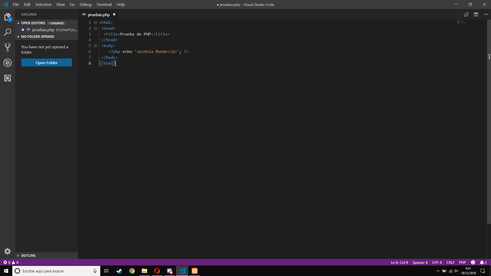
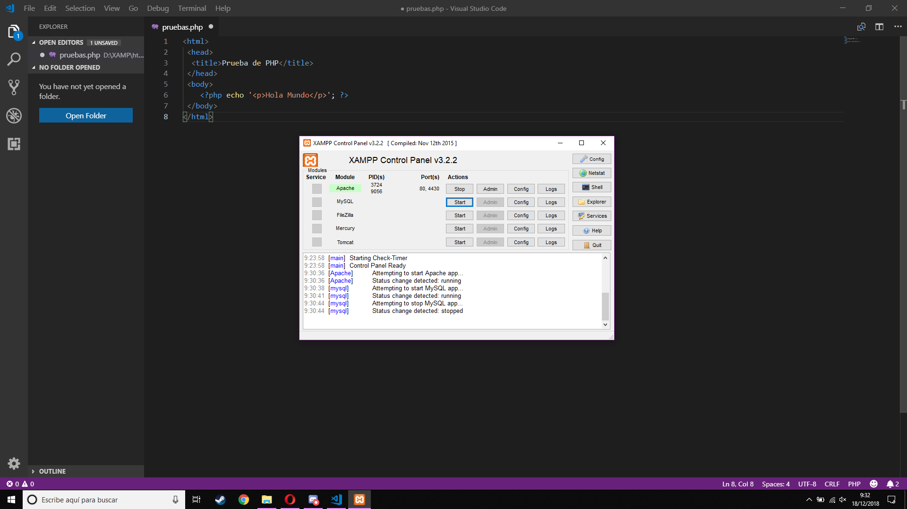

# Aprende un lenguaje de programación en un día (ejercicio voluntario para subir nota).

## Introducción

Cuando te sacaste el carnet de conducir, aprendiste las normas de circulación así como los fundamentos básicos para manejar un coche: volante, marchas, freno, acelerador, embrague, retrovisores... Seguramente, el coche que conduces ahora es diferente al que utilizaste para aprender a conducir, no obstante, lo puedes llevar sin problema. Cada coche tiene sus peculiaridades, pero quien sabe manejar un automóvil, puede adaptarse a las medidas, tacto y comportamiento de un vehículo en cuestión de horas.

Aprender a programar es como aprender a conducir. Si tienes una base sólida de programación y sabes manejar con soltura los tipos de datos, bucles, arrays, clases, métodos, etc. podrás pasar de un lenguaje a otro en un período relativamente corto, simplemente tendrás que adaptarte a la sintaxis y a las peculiaridades del nuevo lenguaje.

Con este ejercicio se pretende despertar el interés por otros lenguajes de programación distintos al que el alumno está estudiando como primer lenguaje.

Sigue los pasos que se indican a continuación.

## Creación del equipo

Este ejercicio se debe hacer en grupos de 3 alumnos. Uno de ellos será el representante del grupo.

## Forkea forkea

El representante del grupo debe hacer un *fork* de este repositorio para utilizarlo como base.

## Añadiendo colaboradores

El encargado del grupo deberá añadir como colaboradores del repositorio *forkeado* a los otros dos miembros, para trabajar todos sobre los mismos archivos. Cuando alguien es colaborador en un repositorio, puede hacer *push* a él sin necesidad de pedir permiso o hacer *pull request*.

Para añadir colaboradores hay que hacer click en la pestaña *Settings* y seleccionar luego *Collaborators* en el menú.

## Miembros del grupo

Escribe aquí los miembros del grupo. El primero es el representante o encargado.

* Alberto Gómez
* Rafael Montes
* Samuel valverde

## Lenguaje de programación

El profesor llevará una cajita llena de papelitos con los nombres de distintos lenguajes de programación. Los encargados de cada grupo meterán la mano en la caja y sacarán dos papelitos, de los cuales el grupo elegirá uno. No se permite hacer intercambio de papelitos entre grupos.

Escribe el lenguaje de programación elegido por el grupo.

* PHP

Los papelitos se han recortado de este [documento](lenguajes_de_programacion.pdf).

## Información sobre el lenguaje

PHP, acrónimo recursivo en inglés de PHP Personal Hypertext processor (preprocesador de hipertexto), es un lenguaje de programación de propósito general de código del lado del servidor originalmente diseñado para el desarrollo web de contenido dinámico. Fue uno de los primeros lenguajes de programación del lado del servidor que se podían incorporar directamente en un documento HTML en lugar de llamar a un archivo externo que procese los datos. El código es interpretado por un servidor web con un módulo de procesador de PHP que genera el HTML resultante.
  
PHP ha evolucionado por lo que ahora incluye también una interfaz de línea de comandos que puede ser usada en aplicaciones gráficas independientes. Puede ser usado en la mayoría de los servidores web al igual que en muchos sistemas operativos y plataformas sin ningún costo.
  
Fue creado originalmente por Rasmus Lerdorf en el año 1995. Actualmente el lenguaje sigue siendo desarrollado con nuevas funciones por el grupo PHP.2​ Este lenguaje forma parte del software libre publicado bajo la licencia PHPv3_01, es una licencia Open Source validada por Open Source Initiative. La licencia de PHP es del estilo de licencias BSD, esta licencia no tiene restricciones de copyleft" asociadas con GPL.
## Herramientas de desarrollo

Hemos empleado software usado con anterioridad en otras asignaturas:  
- Xampp: Para mantener todo el localhost  
- Visual Studio Code: Para escribir el código  
- Opera: para probar el código  
## Poniendo en práctica el lenguaje

Pon en práctica el lenguaje de programación realizando los siguientes ejercicios. Para cada uno de los ejercicios, pega el código fuente de la solución y una captura de pantalla.

### 1. ¡Hola mundo!

Realiza un programa que muestre por pantalla la frase **¡Hola mundo!**.

Paso 1: Dirigirnos a nuestro localhost para crear el archivo: C:/Xampp/htdocs/pruebas/ y hemos creado el fichero pruebas.php  
Paso 2: En VSC hemos escrito el código:  
```PHP
<html>
 <head>
  <title>Prueba de PHP</title>
 </head>
 <body>
 <?php echo '<p>Hola Mundo</p>'; ?>
 </body>
</html>
```  

Paso 3: Hemos iniciado el Xampp para iniciar el servidor  

Paso 4: Hemos abierto el archivo para comprobar que todo funcione correctamente.  


### 2. Pirámide

Dada una altura introducida por el usuario, realiza un programa que pinte una pirámide a base de asteriscos con la altura indicada.

### 3. Arrays y números aleatorios

Realiza un programa que rellene un array (o una estructura similar) con 20 números enteros aleatorios entre 1 y 100 y que seguidamente los muestre por pantalla. A continuación, se deben pasar los números primos a las primeras posiciones del array y los no primos a las posiciones restantes. Muestra finalmente el array resultado.

## Presentación de resultados

Cada equipo explicará al resto de la clase lo aprendido durante la realización del ejercicio. Todos los miembros de cada equipo deben participar en la explicación. Se puede utilizar como material de base para la presentación el repositorio de GitHub.

## Recompensa

* Todos los alumnos que realicen correctamente la actividad tendrán 0'25 puntos extra en la nota del trimestre.

* Los miembros del equipo más votado ganarán un premio.

:star: Si te ha gustado este ejercicio, dale una estrellita al [repositorio original](https://github.com/LuisJoseSanchez/aprende-un-lenguaje-en-un-dia).

